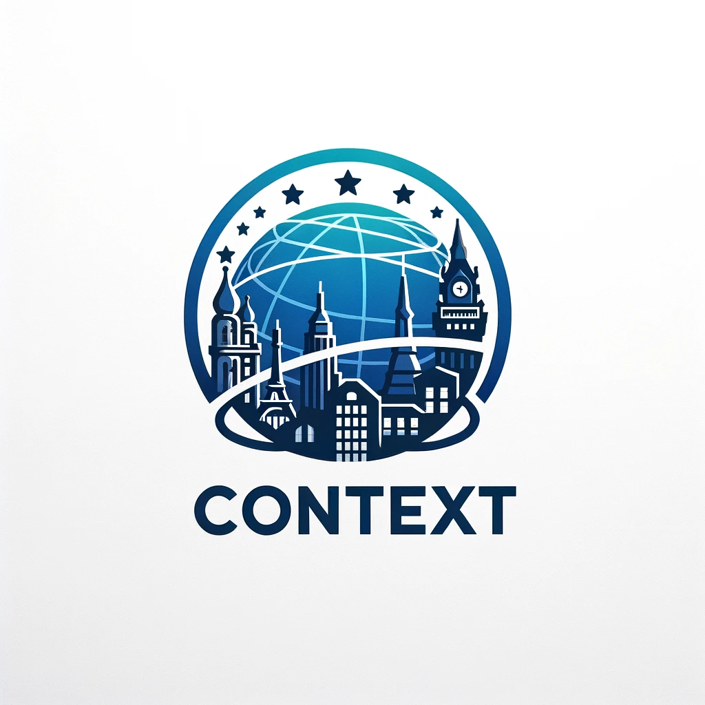

# CONTEXT | International Moving Tool

## About

Welcome to CONTEXT, a comprehensive platform designed to help retirees 
and expatriates find their ideal country to move to. This project aims to provide valuable 
insights into various countries, considering multiple factors such as happiness index, crime safety, 
leisure activities, cost of living, and more. Whether you’re planning your retirement abroad or simply 
exploring new possibilities, our platform equips you with the necessary information to make an informed decision. 
Our app also allows moving companies to connect with potential clients, providing a seamless experience for both parties.
Moving companies are able to upload their services and pricing, while users can easily browse through the available options.
Our platform is ever-growing and evolving, with country pages continuously maintained by country admins to ensure the most up-to-date information. 

This app is being built as an exemplar for Northeastern University's 
Summer 2024 Dialogue of Civilization Program titled *Data and 
Software in International Government and Politics*.  The program is bein
led by Dr. Mark Fontenot and Dr. Eric Gerber from the Khoury College of
Computer Sciences.  

Currently, there are two major components:
- Streamlit App (in the `./app` directory)
- Flask REST api (in the `./api` directory)
- MySQL setup files (in the `./database` directory)

 